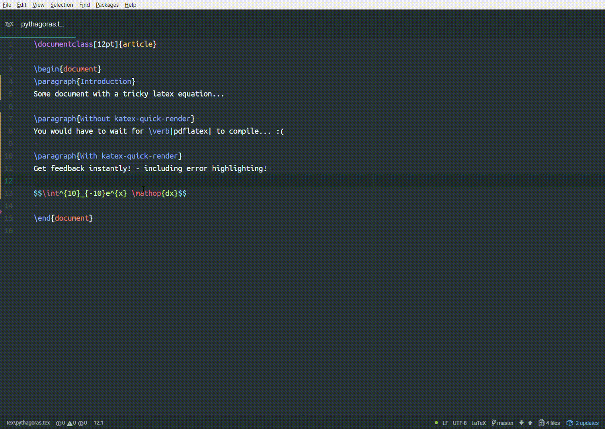

# katex-quick-render

An atom plugin to render LaTeX maths equations instantly using KaTeX. Avoid waiting while your whole pdf compiles.

## Usage

- Toggle the pane with `Ctrl-Alt-K` or use the atom command `Katex Quick Render: Toggle`
- Accept installing the dependency on `language-tex`
- Type into any LaTeX math field
